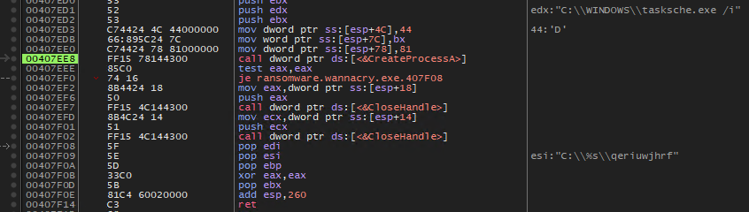

## MALWARE COMPOSITION

|  File Name            |  SHA256 Hash                                                       |
|-----------------------|--------------------------------------------------------------------|
|  wannacry.exe         |  24d004a104d4d54034dbcffc2a4b19a11f39008a575aa614ea04703480b1022c  |
|  tasksche.exe         |  ed01ebfbc9eb5bbea545af4d01bf5f1071661840480439c6e5babe8e080e41aa  |
|  @WanaDecryptor@.exe  |  b9c5d4339809e0ad9a00d4d3dd26fdf44a32819a54abf846bb9b560d81391c25  |
|  taskdl.exe           |  4a468603fdcb7a2eb5770705898cf9ef37aade532a7964642ecd705a74794b79  |
|  taskse.exe           |  2ca2d550e603d74dedda03156023135b38da3630cb014e3d00b1263358c5f00d  |

## EXECUTIVE SUMMARY

### STAGE 1
#### wannacry.exe
* starts itself as a service (`mssecsvc2.0`) via command line by using "%s -m security"
* drops and executes `C:\\WINDOWS\tasksche.exe`
  
### STAGE 2
### tasksche.exe
* it's a PE file containing a zip archive inside the .rsrc section (`PK` magic bytes) (sha256sum: `5873c1b5b246c80ab88172d3294140a83d711cd64520a0c7dd7837f028146b80`)
* `RegCreateKeyW` => `HKLM\Software\WOW6432Node\WanaCrypt0r` and sets it with the path of `tasksche.exe` file
* extracts the embedded zip file  (password is: `WNcry@2ol7`)
* sets `attrib +h` and `icacls . /grant Everyone:F /T /C /Q`
* generates some other files (eg. public encryption keys) and encrypts the data on HDD
* moves all the extracted and generated files into `C:\ProgramData\%randomname%`
    * msg/ (extracted from zip file)
    * b.wnry (extracted from zip file) => `@WanaDecryptor@.bmp`
    * c.wnry (extracted from zip file) => binary file (strings analysis reveals tor client URL and some .onion addresses)
    * r.wnry (extracted from zip file) => `@Please_Read_Me@.txt`
    * s.wnry (extracted from zip file) => zip file containing tor client (TaskData/ containing two other folders: `Data` and `Tor`)
    * t.wnry (extracted from zip file) => binary file
    * u.wnry (extracted from zip file) => `@WanaDecryptor@.exe`
    * taskdl.exe (extracted from zip file)
    * taskse.exe (extracted from zip file)
    * f.wnry (generated) => seems to be a plain text file where are appended some of the encrypted files paths with `.WNCRY` extension
    * 00000000.eky (generated)
    * 00000000.pky (generated)
    * 00000000.res (generated)

* `@WanaDecryptor@.bmp`, `@Please_Read_Me@.txt`, and `@WanaDecryptor@.exe` are also copied on Desktop
  
### STAGE 3
* `taskse.exe` => [?] (needs further analysis)
* `taskdl.exe` => [?] (needs further analysis)
* `@WanaDecryptor@.exe` => [?] (needs further analysis)
* `Tor client` => [?] (May be used as a C2 server?)

## VT ANALYSIS
[VT Link](https://www.virustotal.com/gui/file/24d004a104d4d54034dbcffc2a4b19a11f39008a575aa614ea04703480b1022c)

*Figure 1. Virustotal shows multiple AV detections of the sample.*

*Figure 2. Basic properties and timestamps of the analyzed sample.*
  

*Figure 3. Contacted URLs.*
  

## BASIC STATIC ANALYSIS
### STRINGS ANALYSIS
| FLOSS output |
|--------------|
| http://www[.]iuqerfsodp9ifjaposdfjhgosurijfaewrwergwea[.]com |
| cmd.exe /c "%s" |
| %s\ProgramData |
| %s -m security |
| C:\%s\qeriuwjhrf |
| tasksche.exe |
| WanaCrypt0r |
| \\172.16.99.5\IPC$ |
| \\192.168.56.20\IPC$ |
| unzip 0.15 Copyright 1998 Gilles Vollant |
| inflate 1.1.3 Copyright 1995-1998 Mark Adler |
| multiple strings containing file extensions (eg. doc, zip, jpeg) |
| multiple strings containing .wnry extension (eg. msg/m_italian.wnry) |

*Table 1. This is a list of the most interesting findings of the FLOSS output.*
  
### IMPORT ADDRESS TABLE

| ADVAPI32.dll         | KERNEL32.dll | WININET.dll      |
|----------------------|--------------|------------------|
| CreateServiceA       | CreateFileA  | InternetOpenA    |
| StartServiceA        | MoveFileExA  | InternetOpenUrlA |
| OpenServiceA         |              |                  |
| OpenSCManagerA       |              |                  |
| CryptGenRandom       |              |                  |
| CryptAcquireContextA |              |                  |

*Table 2. This is a list of the most interesting findings of IAT.*
  
### OTHER NOTES
By analyzing the .data section, the PE seems to contain multiple blocks starting with the hexadecimal "4D 5A" magic number ("MZ" string). That makes me think that there are multiple PE files embedded.  

## BASIC DYNAMIC ANALYSIS
### INITIAL DETONATION (inetsim)
By detonating the specimen, apparently nothing seems to be happening if using a simulated network (eg. inetsim/fakenet), but Wireshark reports some DNS queries and HTTP request to the `hxxp://www[.]iuqerfsodp9ifjaposdfjhgosurijfaewrwergwea[.]com` domain.
  

*Figure 4. Wireshark DNS type A query.*  

*Figure 5. Wireshark HTTP request.*  

It seems to be a "check" that the sample make in order to execute itself (maybe to check if it's running on a VM with a simulated network?).  

### INITIAL DETONATION (no network)
By detonating the sample without network connectivity after few seconds we can see the infection symphtoms which are: 
* files encrypted and with a `.WNCRY` extension (some file such as `.exe` will be not encrypted)
* appearance of some files on Desktop: `@Please_Read_Me@.txt`, `@WanaDecryptor@.bmp`, `@WanaDecryptor@.exe`
* background change

*Figure 6. Dropped files and new background.*  

* window pop-up

*Figure 7. Window pop-up demanding ransom payment.*  

## ADVANCED STATIC ANALYSIS
An advanced analysis with Cutter reveals that the sample tries to request the `hxxp://www[.]iuqerfsodp9ifjaposdfjhgosurijfaewrwergwea[.]com` domain and, if it exists, it exits without harming the machine, else it executes the rest of the program by calling the `fcn.00408090` function (see Figure 4 and 5 below).  

This is basically the killswitch of this ransomware.  

*Figure 8. The main function graph of the specimen.*  
  

*Figure 9. The decompiled main function (Ghidra decompiler).*  
  
The execution follows into a `jge` instruction that leads to two distinct functions.

*Figure 10-11. The execution flow.*  
  
The first one seems to use somehow the `%s -m security` string and then use the `CreateServiceA` API call to create a service named `mssecsvc2.0`

*Figure 12. fcn_00407c40 flow.*  
  
The second one seems to load an embedded resource, extract, and execute it.

*Figure 13. fcn_00407ce0 flow.*  

## ADVANCED DYNAMIC ANALYSIS
First of all, the advanced dynamic analysis can confirm the jump observed during both the initial detonation with networking and the advanced static analysis. 

*Figure 14. Wannacry killswitch.*  
  
Follows the call to `408090` address location which leads to the rest of the program execution.

*Figure 15. Program flow.*  
  

*Figure 16. Program flow.*  
  
The first call points to `407C40` address location leads to the execution of `%s -m security` that launches `wannacry.exe` with this parameter and during the flow the previous `jge` instruction jump is taken.

*Figure 17. "%m -security" execution*  
  
This triggers the SMB flooding which uses the EternalBlue SMBv1 exploit.

*Figure 18. SMB Flooding*  
  
The second call points to `407CE0` address location leads to the execution of

*Figure 19. tasksche.exe drop and execution*  
  

*Figure 20. tasksche.exe file created*  
  

*Figure 21-22. tasksche.exe executed*  

  
At this point I got the `tasksche.exe` sample to analyze it (after that I realized that it can be dumped. eg. with `pestudio`) and it seems to have an embedded zip file which can also be dumped and extracted.

*Figure 23. tasksche.exe embedded pkzip file*  

Premise: I executed `tasksche.exe` from Desktop, but you're supposed to consider that originally it'll be executed from the drop location `C:\\WINDOWS\tasksche.exe`.
First of all, it created a registry key `HKLM\Software\WOW6432Node\WanaCrypt0r` and sets it with the path of `tasksche.exe` file, which in my case is desktop location.

*Figure 24. RegCreateKey*  
  
Then it unpacks the embedded zip file by using the password `WNcry@2ol7`. 

*Figure 25. Zip Password*  
  

*Figure 26. RegCreateKey*  
  
At this point the program sets sets `attrib +h` (hidden attribute) and `icacls . /grant Everyone:F /T /C /Q` (which grants full access permissions to all users) and then starts the files encryption. 

*Figure 25. Attrib +h and icacls*  

During the rest of the program execution some other files such as `f.wnry` (which is a plain text file containing some encrypted files path), publick encryption keys, `%randomname%.bat` and `m.vsb`. (Note: the `.bat` and `m.vsb` files are deleted after the execution).
Also, another folder is dropped (`TaskData`) and it contains a `Tor client` executable. 

## INDICATORS OF COMPROMISE (IOCs)

### HOST-BASED INDICATORS
#### Hashes
    24d004a104d4d54034dbcffc2a4b19a11f39008a575aa614ea04703480b1022c
    ed01ebfbc9eb5bbea545af4d01bf5f1071661840480439c6e5babe8e080e41aa
    b9c5d4339809e0ad9a00d4d3dd26fdf44a32819a54abf846bb9b560d81391c25
    4a468603fdcb7a2eb5770705898cf9ef37aade532a7964642ecd705a74794b79
    2ca2d550e603d74dedda03156023135b38da3630cb014e3d00b1263358c5f00d

#### Registry
    HKLM\Software\WOW6432Node\WanaCrypt0r

#### Services
    mssecsvc2.0
    Microsoft Security Center (2.0) Service

#### Paths
    C:\\WINDOWS\\tasksche.exe

### NETWORK INDICATORS
#### URL[s]
    hxxp://www[.]iuqerfsodp9ifjaposdfjhgosurijfaewrwergwea[.]com

#### TCP
    TCP Connect to random IPs on port 445 (SMB filesharing)

## RULES & SIGNATURES
    rule wncry2017 {
        meta: 
          last_updated = "2024-05-02"
          author = "Mr0x4b"
          description = "A Yara rule for Wannacry Ransomware sample."

      strings:
          $string1 = "http://www.iuqerfsodp9ifjaposdfjhgosurijfaewrwergwea.com"
          $string2 = "mssecsvc2.0"
          $string3 = "tasksche.exe"
          $string4 = "WanaCrypt0r"
          $string5 = "icacls . /grant Everyone:F /T /C /Q"
          $string6 = "attrib +h"
          $string7 = "WNcry@2ol7"
          $string8 = "115p7UMMngoj1pMvkpHijcRdfJNXj6LrLn"
          $string9 = "12t9YDPgwueZ9NyMgw519p7AA8isjr6SMw"
          $string10 = "13AM4VW2dhxYgXeQepoHkHSQuy6NgaEb94"
          $PE_magic_byte = "MZ"
          $PK_magic_byte = {50 4B 03 04 14 00 01 00 08 00 AA A1 AB 4A FE 21}
  
      condition:
          $PE_magic_byte at 0 and
          any of ($string1, $string2, $string3, $string4, $string7) and
          any of ($string5, $string6) and
          ($string8 or $string9 or $string10) and
          $PK_magic_byte
    }